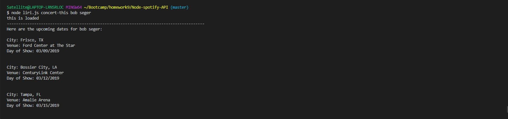
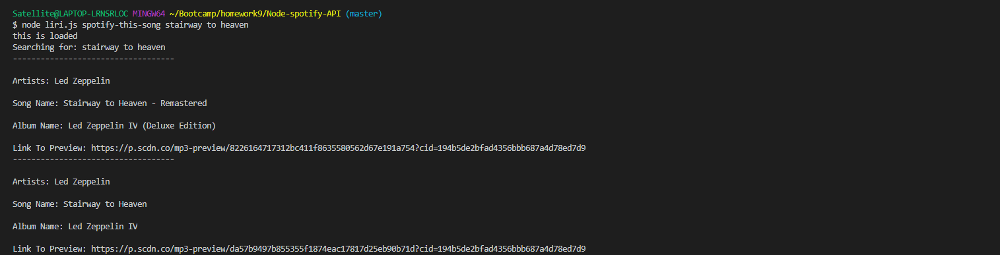
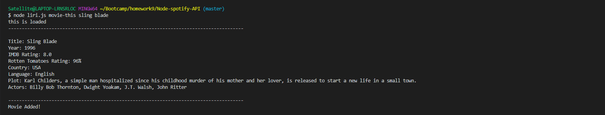
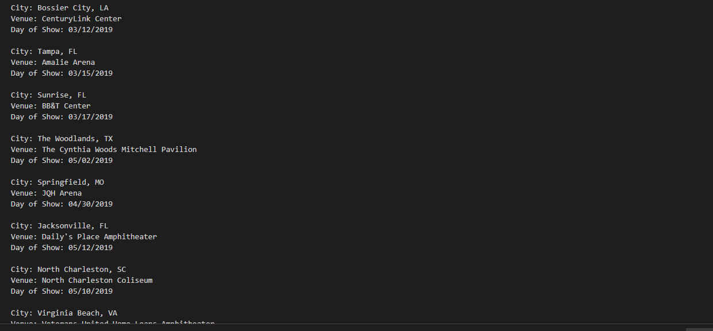
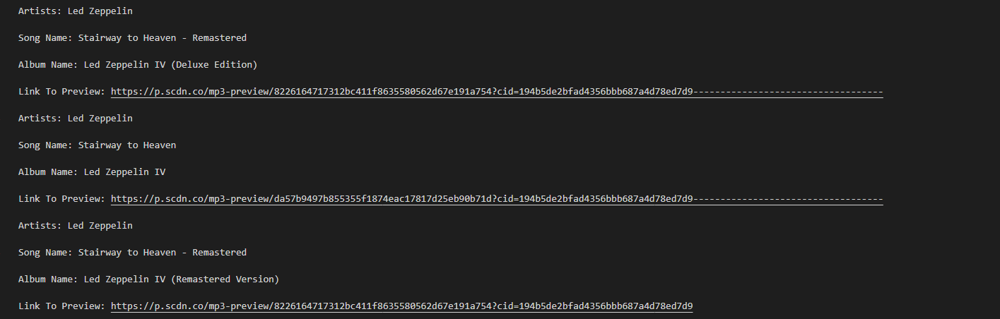
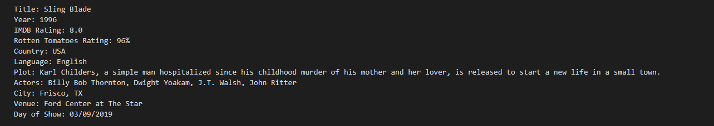

# Node-spotify-API
Node API calls using the Spotify, Bands in town and OMDB APIs.

#How it works

In this Node.js app there are three selectors to choose from; concert-this (Band in Town API), movie-this (OMDB API) and spotify-this-song (Spotify API).

When you call the liri.js file in your terminal. you can select any of the three depending on what you would like to search for:

Once the data is returned it is then logged in a .txt file to be able to access at a later time. Note that the Spotify API call will return the first three songs that make your query and the concert-this call will return all upcoming shows for the searched artist.

If any of the entries are left blank when a call is requested. They will return their own default values. for the Bands in town API it will default to Bob Seger, the Spotify API will return "The Sign" by Ace of Base and the OMDB call will default to "Mr. Nobody".
